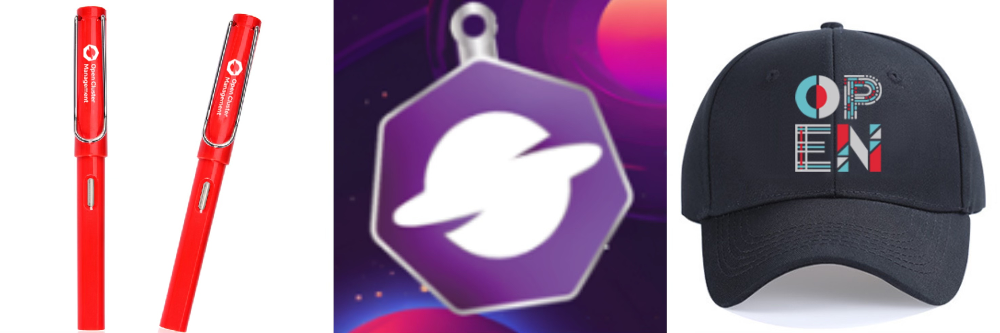

KubeCon + CloudNativeCon China 2025 即将于6 月 10-11 日在香港盛大举行，这是云原生领域最具影响力的技术盛会之一。作为云原生多集群管理领域的领军项目之一，Open Cluster Management (OCM) 社区将带来三个精彩议题，与您共同探讨多集群管理领域的最新创新和突破。在这里，您将有机会与来自全球的云原生专家面对面交流，深入了解 OCM 如何通过创新的技术方案，帮助企业应对日益复杂的多集群管理挑战，开启云原生多集群管理的新篇章。

## 议题信息

### [闪电演讲：使用OCM Addon简化多集群集成](https://kccncchn2025.sched.com/event/1xjzH/project-lightning-talk-simplifying-multi-cluster-integrations-with-ocm-addon-jian-zhu-maintainer?iframe=no&w=100%&sidebar=yes&bg=no)

**时间**：6 月 10 日 11:42 - 11:47 HKT  
**地点**：Level 16 | Grand Ballroom I  
**演讲者**：Jian Zhu (Red Hat)

在这个闪电演讲中，Jian Zhu 将介绍 OCM 的 Addon 机制，展示如何通过简单的 YAML 文件实现多集群能力的扩展。主要内容包括：

- OCM Addon 机制概述及其在多集群环境中的作用
- 项目集成案例：以 Fluid 为例，展示如何通过 Addon 增强多集群管理能力
- AddonTemplate API：简化 addon 创建和管理的创新方案
- 实际应用价值：展示 OCM Addons 的效率和可扩展性

### [解锁 CEL 在多集群调度中的强大能力](https://kccncchn2025.sched.com/event/1x5jG/unlocking-the-power-of-cel-for-advanced-multi-cluster-scheduling-qing-hao-jian-qiu-red-hat?iframe=no&w=100%&sidebar=yes&bg=no)

**时间**：6 月 10 日 17:00 - 17:30 HKT  
**地点**：Level 19 | Crystal Court II  
**演讲者**：Qing Hao (Red Hat)

Common Expression Language (CEL) 作为 Kubernetes API 中的强大工具，在 Kubernetes v1.32 中被用于变异准入策略，同时也在 Envoy 和 Istio 中得到广泛应用。本次演讲将深入探讨 CEL 在多集群调度中带来的优势和特性。

随着多集群调度需求的不断增长，用户对调度策略的精细化和定制化要求越来越高。例如，用户可能希望使用 "version" > v1.30.0 这样的标签表达式来筛选集群，而不是简单地列出所有版本。许多用户还希望能够使用自定义资源（CRD）字段或指标来进行调度决策。CEL 的扩展性能够有效应对这些挑战，因为它可以处理复杂的表达式。

在本次演讲中，我们将展示 Open Cluster Management (OCM) 如何利用 CEL 实现多集群调度。以 ClusterProfile API 为例，我们将演示 CEL 如何满足复杂的调度需求，并通过解决装箱（bin-packing）问题来展示其在提升 AI 应用 GPU 资源利用率方面的潜力。

### [统一混合多集群认证体验：SPIFFE 与 Cluster Inventory API 的结合](https://kccncchn2025.sched.com/event/1x5jq/connecting-dots-unified-hybrid-multi-cluster-auth-experience-with-spiffe-and-cluster-inventory-api-chen-yu-microsoft-jian-zhu-red-hat?iframe=no&w=100%&sidebar=yes&bg=no)

**时间**：6 月 11 日 13:45 - 14:15 HKT  
**地点**：Level 16 | Grand Ballroom I  
**演讲者**：Chen Yu (Microsoft) & Jian Zhu (Red Hat)

随着多集群模式的不断发展，为团队和多集群应用（如 Argo 和 Kueue）管理 Kubernetes 身份、凭证和权限变得越来越繁琐。目前的做法通常需要在每个集群上单独管理服务账号，并在集群间传递凭证。这种设置往往分散、重复，难以追踪和审计，还可能带来安全和运维方面的挑战。在混合云环境中，由于不同平台可能采用不同的解决方案，这个问题尤为突出。

本次演示将介绍一个基于 OpenID、SPIFFE/SPIRE 和 Multi-Cluster SIG 的 Cluster Inventory API 的解决方案，它能够提供统一、无缝且安全的认证体验。通过 CNCF 多集群项目 OCM 和 Kueue 的支持，与会者将了解如何利用开源解决方案来消除凭证分散问题，降低运维复杂度，并在混合云环境中为团队和应用访问多集群设置时提升安全性。

## 演讲者信息

#### Jian Zhu
**职位**：高级软件工程师，Red Hat  
**简介**：Jian Zhu 是 Red Hat 的高级软件工程师，KubeCon China 2024 的演讲嘉宾，也是 Open Cluster Management 项目的核心贡献者。他专注于解决多集群工作负载分发问题和通过 addon 机制扩展 OCM 的功能。

#### Qing Hao
**职位**：高级软件工程师，Red Hat  
**简介**：Qing Hao 是 Red Hat 的高级软件工程师，担任 Open Cluster Management 的维护者。她同时担任 CNCF Ambassador，是 KubeCon China 2024 的演讲嘉宾，以及 OSPP 2022 和 GSoC 2024 的导师。她专注于解决多集群环境中的复杂挑战，例如应用调度和管理组件的滚动升级。在加入 Red Hat 之前，Qing 曾在 IBM 工作，在容器、云原生技术和高性能计算（HPC）领域拥有多年经验。

## 展台信息

除了精彩的演讲，Open Cluster Management 还将在 KubeCon China 2025 设置展台，欢迎您前来交流！

**展台信息**：
- **项目**：Open Cluster Management
- **展台编号**：8
- **展台位置**：Hopewell Hotel | Level 16 | Grand Ballroom II | Solutions Showcase
- **展台时间**：6 月 11 日 10:15 - 12:30 HKT 

在展台，您将有机会：
- 与 OCM 核心开发者面对面交流
- 了解最新的多集群管理解决方案
- 探讨实际应用场景和技术挑战
- 获取社区资源和参与方式以及一些精美的小礼品

## 加入我们

Open Cluster Management 社区诚挚邀请您参加这些精彩演讲，一起探讨多集群管理的未来发展方向。无论您是开发者、运维工程师还是架构师，都能在这些议题中找到有价值的内容。

让我们相约 KubeCon China 2025，共同探讨云原生多集群管理的创新与实践！

## 相关资源

- [Open Cluster Management 项目主页](https://open-cluster-management.io)
- [GitHub 仓库](https://github.com/open-cluster-management-io)
- [社区 Slack 频道](https://kubernetes.slack.com/channels/open-cluster-mgmt)