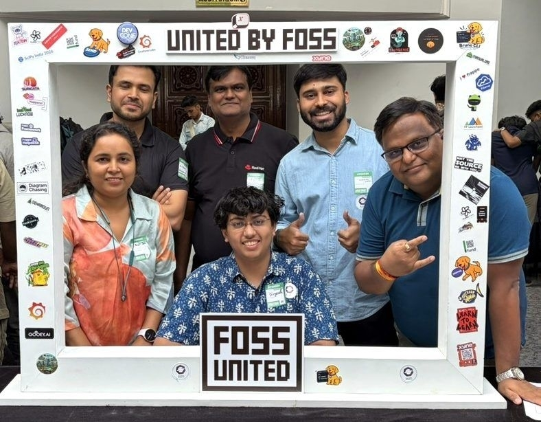
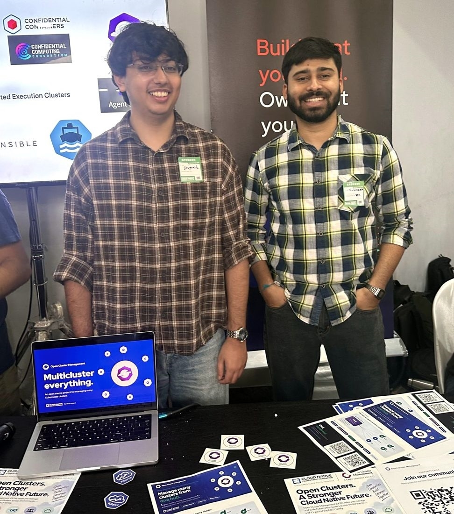
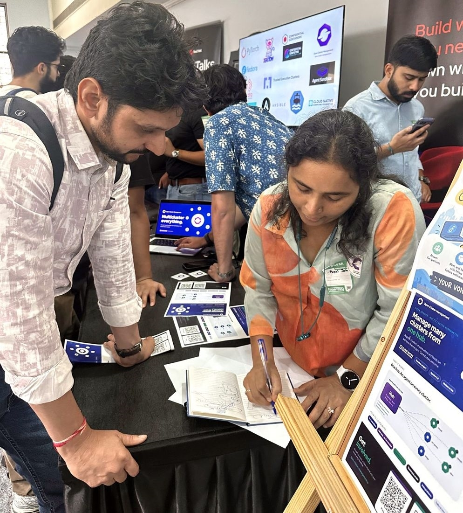

On the weekend of September 26–27, four of us — Divyansh Kamboj, Payal Jain, Manoj Kumar
Gupta and Kushagra Gupta — ran an Open Cluster Management table at
[IndiaFOSS 2026](https://fossunited.org/indiafoss/2026), the sixth edition of FOSS United's
annual free and open source festival, held at the NIMHANS Convention Centre in Bengaluru.

Over two days, somewhere between 40 and 50 people stopped by — first-time contributors,
students who had never heard of a hub-and-spoke control plane, and engineers already running
fleets of Kubernetes clusters in production. This is a short write-up of what we heard.

## "How do I actually start contributing to a CNCF project?"

This was, by a wide margin, the most common question at the table, and most of the people
asking it were students.

It is a harder question to answer well than it looks. "Pick a good first issue" is true but
not very useful if you have never seen the codebase and have no mental model of what the
project does. So we spent most of the weekend doing the part that comes before that: sketching
out what OCM is for — registering many clusters with a hub, placing workloads across them,
distributing policy and add-ons — and only then pointing at the parts of the repository where
a newcomer could make a real dent.

Most visitors left with a couple of stickers and a flyer carrying a project overview and a QR
code to the community page. At least one of them has already joined the community to start
contributing.

We also met some genuinely impressive people along the way. One first-year student had already
contributed multiple patches to the Linux kernel.

## The AI question

Some of the sharpest questions of the weekend came from students, and a surprising number
of them were about AI.

Not "does OCM use AI" — the question was consistently about the *other* side of it: how do
maintainers cope with AI-generated pull requests, and what happens to review capacity when
the cost of opening a PR drops to near zero?

That is an open question for most open source projects right now, and we did not pretend to
have a settled answer. What struck us was that newcomers were already thinking about
maintainer workload as a shared resource — worrying about the reviewer's time before they
had ever submitted a patch. That is a healthy instinct, and not one we expected to spend the
weekend discussing.

## People already living with the problem

Not everyone at the table was new to the space. We also talked to developers from several
companies who were already operating multiple clusters in production and had simply never
come across OCM.

Those conversations went somewhere different. Instead of explaining what multi-cluster
management is for, we went straight into architecture: the problems that start to pile up
once you are managing a fleet of clusters rather than one or two, and how OCM's hub-and-spoke
model approaches them.

Hearing those problems from the people who live with them every day — rather than inferring
them from issue trackers — was a highlight of the weekend.

## What we took away

Three things stayed with us:

- **There is real demand for a well-lit path in.** Students are actively looking for a CNCF
  project to contribute to. The projects that make the first hour legible are the ones that
  get the contributors. That is worth investing in.
- **Newcomers are thinking about maintainer load.** The AI-generated-PR question came up
  unprompted, repeatedly, from people who had not yet made their first contribution.
- **Plenty of fleet operators have never heard of OCM.** Some of the people best positioned
  to use the project were hearing about it for the first time at a booth. Showing up at
  community events is not just outreach; it is how we find out who we are missing.

## Get involved

If any of the above sounds like your problem — or your weekend project — here is where to start:

- **Try it out:** the [Getting Started guide](https://open-cluster-management.io/docs/getting-started/)
  will get a hub and a managed cluster running.
- **Code:** everything lives at
  [github.com/open-cluster-management-io](https://github.com/open-cluster-management-io).
- **Chat:** [#open-cluster-mgmt](https://kubernetes.slack.com/channels/open-cluster-mgmt) on
  the Kubernetes Slack is the busiest channel (grab an invite at
  [slack.k8s.io](https://slack.k8s.io) first).
- **Community meetings:** the schedule is on the
  [community calendar](https://calendar.google.com/calendar/u/0/embed?src=openclustermanagement@gmail.com),
  with [agenda and notes](https://docs.google.com/document/d/1CPXPOEybBwFbJx9F03QytSzsFQImQxeEtm8UjhqYPNg)
  open to everyone. Recordings go up on
  [YouTube](https://www.youtube.com/c/OpenClusterManagement).
- **Ask anything:** [GitHub Discussions](https://github.com/open-cluster-management-io/community/discussions)
  or the [mailing list](https://groups.google.com/g/open-cluster-management).

New contributors are welcome, and "I stopped by your table in Bengaluru" is a perfectly good
way to open a thread.

## Thanks

Thanks to FOSS United for organising IndiaFOSS and for the work that goes into making it a
welcoming event, to everyone who helped put the booth together, and to all 40-odd people who
wandered over to ask what a hub cluster is. We hope to see some of you in a pull request.
