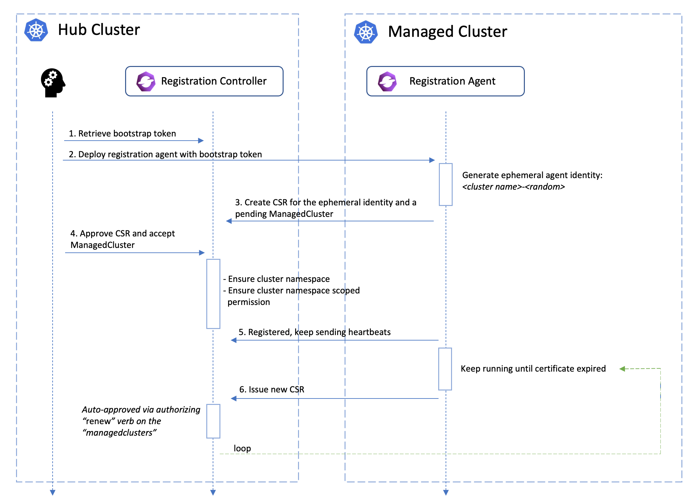

## 概述
在`open-cluster-management`中，为了使控制面有更好的可扩展性，我们使用了`hub-spoke`的架构：即集中的控制面（hub只
负责处理控制面的资源和数据而无需访问被管理的集群；每个被管理集群（spoke）运行一个称为`klusterlet`的agent访问控制面获取
需要执行的任务。在这个过程中，`klusterlet`需要拥有访问`hub`集群的秘钥才能和`hub`安全通信。确保秘钥的安全性是非常重要的，
因为如果这个秘钥被泄露的话有可能导致对hub集群的恶意访问或者窃取敏感信息，特别是当`ocm`的被管理集群分布在不同的公有云中的时候。
为了保证秘钥的安全性，我们需要满足一些特定的需求：
1. 尽量避免秘钥在公有网络中的传输
2. 秘钥的刷新和废除
3. 细粒度的权限控制

本文将详细介绍`ocm`是如何实现秘钥的管理来保证控制面板和被管理集群之间的安全访问的。

## 架构和机制

在ocm中我们采用了以下几个机制来确保控制面和被管理集群之间访问的安全性：

1. 基于`CertificateSigniningRequest`的mutual tls
2. 双向握手协议和动态`klusterlet`ID
3. 认证和授权的分离

### 基于`CertificateSigniningRequest`的mutual tls

使用`kubernetes`的`CertificateSigniningRequest`（[CSR](https://kubernetes.io/docs/reference/access-authn-authz/certificate-signing-requests/)）API可以方便的生成客户认证证书。这个机制可以让`klusterlet`在第一次
启动访问`hub`集群时使用一个权限很小的秘钥来创建CSR。当CSR返回了生成的证书后，`klusterlet`就可以用后续生成的带有更大访问权限的
证书来访问`hub`集群。在使用csr的过程中，`klusterlet`的私钥不会在网络中传输而是一直保存在被管理集群中；只有CSR的公钥和初始阶段需要的
小权限秘钥（bootstrap secret）会在不同集群间传输。这就最大程度的保证秘钥不会在传输过程中被泄露出去。

### 双向握手协议和动态`klusterlet`ID

那么如果初始阶段的bootstrap secret被泄露了会怎么样呢？这就牵涉到OCM中的双向握手协议。当被管理集群中的`klusterlet`使用bootstrap secret
发起了第一次请求的时候, hub集群不会立刻为这个请求创建客户证书和对应的访问权限。这个请求将处在`Pending`状态，直到hub集群拥有特定管理权限的管理员
同意了`klusterlet`的接入请求后，客户证书和特定权限才会被创建出来。这个请求中包含了`klusterlet`启动阶段生成的动态ID，管理员需要确保这个ID和被
管理集群上`klusterlet`的ID一致才能同意`klusterlet`的接入。这也就确保了如果bootstrap secret被不慎泄露后，CSR也不会被管理员轻易的接受。

`klusterlet`使用的客户证书是有过期时间的，`klusterlet`需要在证书过期之前使用现有的客户证书发起新的`CSR`请求来获取新的客户证书。`hub`集群会检验
更新证书的`CSR`请求是否合法并自动签署新的客户证书。需要注意的是由于`klusterlet`使用了动态ID的机制，只有`klusterlet`本身发起的`CSR`请求才会
被自动签署。如果`klusterlet`在集群中被卸载然后重新部署后，它必须重新使用bootstrap secret流程来获取客户证书。

### 认证和授权的分离

在`klusterlet`的`CSR`请求被接受后，它获得了被`hub`集群认证通过的客户证书，但是它在这个时候还没有对`hub`集群上特定资源访问的权限。
`ocm`中还有一个单独的授权流程。每个被管理集群的`klusterlet`时候有权限访问`hub`集群的特定资源是被对应`ManagedCluster`API上的
`hubAcceptsClient`域来控制的。只有当这个域被置位`true`时，`hub`集群的控制器才会为对应`klusterlet`赋予权限。而设置这个域需要用户
在`hub`集群中对`managedcluster/accept`具有`update`权限才可以。如下面的`clusterrole`的例子表示用户只能对`cluster1`这个
`ManagedCluster`上的`klusterlet`赋予权限。

```yaml
apiVersion: rbac.authorization.k8s.io/v1
kind: ClusterRole
metadata:
  name: open-cluster-management:hub
rules:
- apiGroups: ["register.open-cluster-management.io"]
  resources: ["managedclusters/accept"]
  verbs: ["update"]
  resourceNames: ["cluster1"]
```

将认证和授权的流程分开的原因是通常情况下`hub`集群具有`approve CSR`权限的用户和"允许klusterlet接入hub"集群的用户并不完全一致。以上
机制就可以保证即使用户拥有`approve CSR`的权限也不能给任意的`klusterlet`赋予接入`hub`集群的权限。

## 实现细节

所有认证授权和秘钥管理的代码实现都在[registration](https://github.com/open-cluster-management-io/ocm/tree/main/cmd/registration)组件中。大概的流程
如下图所示



当`registration-agent`在被管理集群中启动后，会首先在自己的`namespace`里查找是否有`hub-kubeconfig`的秘钥并验证这个秘钥是否合法。
如果不存在或者不合法，`registration-agent`就进入了bootstrap流程，它会首先产生一个动态的`agent ID`, 然后使用一个更小权限的
`bootstrap-kubeconfig`来创建client和informer，接下来启动一个`ClientCertForHubController`的goroutine。这个controller会在hub集群
创建CSR,等待CSR中签署的证书并最终把证书和私钥做为名为`hub-kubeconfig`的秘钥持久化在被管理集群中。agent接着持续监控`hub-kubeconfig`
这个秘钥是否已经被持久化。当agent发现`hub-kubeconfig`则意味着agent已经获取到了可以访问`hub`集群的客户证书，agent就会停掉之前的controller并
退出bootstrap流程。接下来agent会重新用`hub-kubeconfig`创建client和informer，并启动一个新的`ClientCertForHubController`的goroutine
来定期刷新客户证书。

在hub集群中的`registration-controller`会启动`CSRApprovingController`用来负责检查`klusterlet`发起的CSR请求是否可以自动签发；以及
`managedClusterController`用来检查对应`ManagedCluster`上的`hubAccepctsClient`域是否被设置并在`hub`集群中创建相应的权限。
