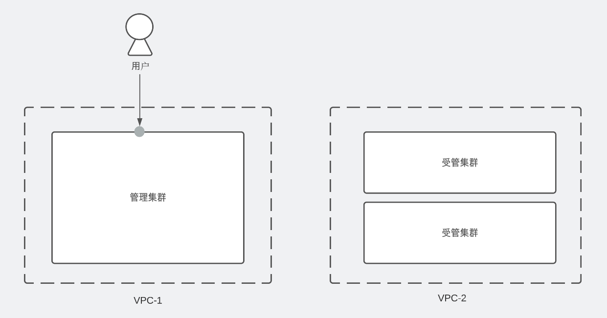
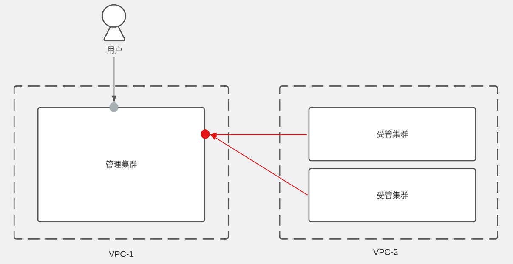
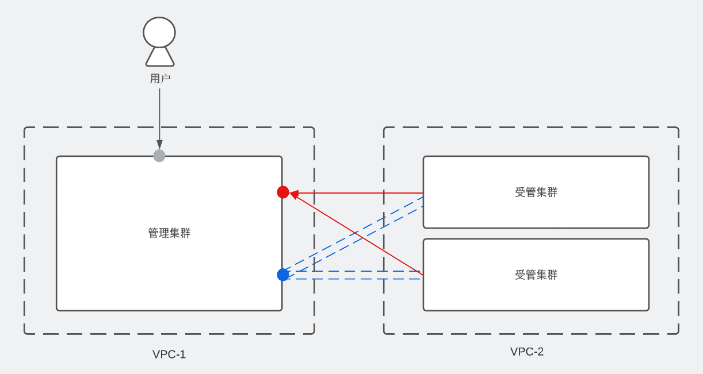
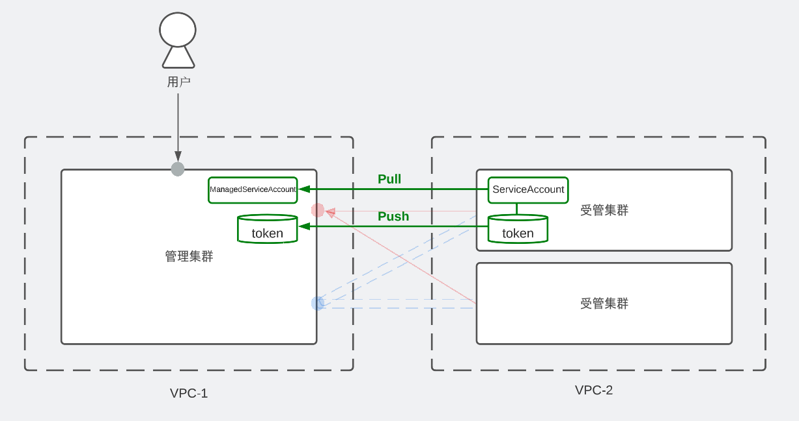

2022年4月20日 [薛昭](https://github.com/xuezhaojun)



## 问题背景

当我们拥有多个集群时，一个很常见的需求是：不同的用户希望能访问位于不同VPC下的集群。比如，开发人员希望能够在测试集群部署应用，或者运维人员希望能够在生产集群上进行故障排查。

作为多个集群的管理员，为了实现该需求，需要在各个集群为用户：
1. 绑定Role。
2. 提供访问配置（证书或Token）。
3. 提供访问入口。

但是，这种方式有以下几个问题：
* 网络隔离：集群位于私有数据中心，那么管理员就需要为集群用户进行特殊的网络配置，比如建立VPN或者跳板机。
* 网络安全：为用户暴露的集群端口，会增加集群的安全风险。
* 配置过期：证书中的秘钥和Token都有过期时间，管理员需要定期为用户做配置更新。

而通过安装OCM以及cluster-proxy，managed-serviceaccount两个插件，管理员则可以在不暴露集群端口的情况下，为不同用户提供统一访问入口，并方便地管理不同用户的访问权限。

## 基本概念

以下，我们通过一个简单的例子来解释OCM以及cluster-proxy，managed-serviceaccount的基本概念。

假设我们有3个集群，分别位于两个不同的VPC中，其中VPC-1中的集群可以被所有用户访问，而VPC-2中的2个集群只能被管理员访问。

管理员希望通过VPC-1中的集群（后文称“管理集群”）为用户提供统一的访问入口，使用户可以访问VPC-2中的集群（后文称“受管集群”）。



### OCM是什么？

OCM 全称为 Open Cluster Management，旨在解决多集群场景下的集群注册管理，工作负载分发，以及动态的资源配置等功能。

安装OCM之后，我们可以将受管集群注册加入管理集群，完成注册后，在管理集群中会创建一个与受管集群注册名相同的命名空间。比如，受管集群以cluster1注册到管理集群，那么就会对应创建一个名为cluster1的命名空间。在管理集群上，我们可以通过这些不同的命令空间来区分多个受管集群的资源。

注册过程不要求受管集群向管理集群暴露访问接口。



更多有关于OCM的架构细节，请参考[官方文档](https://open-cluster-management.io/concepts/architecture/)。

### cluster-proxy是什么？

cluster-proxy是使用OCM的[addon-framework](https://github.com/open-cluster-management-io/addon-framework)实现的一个基于 [apiserver-network-proxy](https://github.com/kubernetes-sigs/apiserver-network-proxy)（后文简写为：ANP）的插件。插件安装后，会在管理集群上安装ANP的组件proxy-server，在受管集群上安装ANP的组件proxy-agent。

接着proxy-agent通过管理集群上暴露的端口，向proxy-server发送注册请求，并建立一条全双工通信的GRPC管道。

需要注意的是，cluster-proxy建立的GRPC通道只是保证了管理集群到被管理集群的网络连通性，如果用户想访问被管理集群的APIServer或者其他服务，仍需要从被管理集群获得相应的认证秘钥和权限。



更多有关cluster-proxy的信息，请参考[官方文档](https://open-cluster-management.io/getting-started/integration/cluster-proxy/)。

### managed-serviceaccount是什么？

Managed-serviceaccount（后文简写为：MSA）也是利用OCM的[addon-framework](https://github.com/open-cluster-management-io/addon-framework)实现的插件。

安装该插件后，可以在管理集群上配置`ManagedServiceAcccount`的CR，插件会根据此CR的`spec`配置，在目标受管集群的`open-cluster-management-managed-serviceaccount`命名空间内，创建一个与CR同名的`ServiceAccount`。

接着插件会将此`ServiceAccount`生成的对应token数据同步回管理集群，并在受管集群的命令空间中创建一个同名的`Secret`，用于保存该token。整个token的数据同步都是在OCM提供的MTLS连接中进行，从而确保token不会被第三方探查到。

由此集群管理员可以在hub上通过MSA来获得访问被管理集群APIServer的token。当然这个token现在还没有被赋予权限，只要管理员为该token绑定相应的Role，就可以实现访问被管理集群的权限控制。



更多有关managed-serviceaccount的信息，请参考[官方文档](https://open-cluster-management.io/getting-started/integration/managed-serviceaccount/)。

## 样例

接下来通过一个简单的例子来演示如何使用OCM，cluster-proxy，managed-serviceaccount来实现跨VPC访问集群。

首先从管理员视角，我们通过脚本快速创建一个基于[kind](https://kind.sigs.k8s.io/)的多集群环境，其中具有一个管理集群（hub），以及两个受管集群（cluster1, cluster2）。并且 cluster1, cluster2 会通过 OCM 注册到了 hub。

该脚本还会为我们安装OCM的CLI工具[clusteradm](https://github.com/open-cluster-management-io/clusteradm)。

```bash
curl -L <https://raw.githubusercontent.com/open-cluster-management-io/OCM/main/solutions/setup-dev-environment/local-up.sh> | bash
```

然后，管理员还需要安装两个插件：

```bash
# 安装 cluster-proxy
helm install \\
    -n open-cluster-management-addon --create-namespace \\
    cluster-proxy ocm/cluster-proxy

# 安装 managed-service
helm install \\
    -n open-cluster-management-addon --create-namespace \\
    managed-serviceaccount ocm/managed-serviceaccount

# 验证 cluster-proxy 已安装
clusteradm get addon cluster-proxy

# 验证 managed-serviceaccount 已安装
clusteradm get addon managed-serviceaccount
```

完成安装后，管理员希望给用户能够访问cluster1，他需要通过以下命令创建一个在hub的命令空间cluster1中，创建一个MSA的CR：

```bash
kubectl apply -f - <<EOF
apiVersion: authentication.open-cluster-management.io/v1alpha1
kind: ManagedServiceAccount
metadata:
  name: dep
  namespace: cluster1
spec:
  rotation: {}
EOF

# 检查Token是否已同步回管理集群hub，并保存为名为dep的Secret
kubectl get secret -n cluster1
NAME                  TYPE                                  DATA   AGE
default-token-r89gs   kubernetes.io/service-account-token   3      6d22h
dep                   Opaque                                2      6d21h
```

接着，管理员需要通过OCM的[Manifestwork](https://open-cluster-management.io/concepts/manifestwork/), 即工作负载分发功能，在cluster1上创建一个`ClusterRole`，给dep绑定了cluster1上的对应权限：

```bash
# 创建ClusterRole, 仅具有操作Deployment的权限
clusteradm create work dep-role --cluster cluster1 -f - <<EOF
apiVersion: rbac.authorization.k8s.io/v1
kind: ClusterRole
metadata:
  name: dep-role
rules:
- apiGroups: ["apps"]
  resources: ["deployments"]
  verbs: ["get", "watch", "list", "create", "update", "patch", "delete"]
EOF

# 绑定ClusterRole
clusteradm create work dep-rolebinding --cluster cluster1 -f - <<EOF
apiVersion: rbac.authorization.k8s.io/v1
kind: ClusterRoleBinding
metadata:
  name: dep-rolebinding
roleRef:
  apiGroup: rbac.authorization.k8s.io
  kind: ClusterRole
  name: dep-role
subjects:
  - kind: ServiceAccount
    name: dep
    namespace: open-cluster-management-managed-serviceaccount
EOF
```

完成之后，用户便可以通过cluteradm，来操作cluster1上`Deployments`了：

```bash
clusteradm proxy kubectl --cluster=cluster1 --sa=dep -i
Please enter the kubectl command and use "exit" to quit the interactive mode
kubectl> get deployments -A
NAMESPACE                                        NAME                                 READY   UP-TO-DATE   AVAILABLE   AGE
kube-system                                      coredns                              2/2     2            2           20d
local-path-storage                               local-path-provisioner               1/1     1            1           20d
open-cluster-management-agent                    klusterlet-registration-agent        1/1     1            1           20d
open-cluster-management-agent                    klusterlet-work-agent                1/1     1            1           20d
open-cluster-management-cluster-proxy            cluster-proxy-proxy-agent            3/3     3            3           20d
open-cluster-management-managed-serviceaccount   managed-serviceaccount-addon-agent   1/1     1            1           20d
open-cluster-management                          klusterlet                           3/3     3            3           20d
# 用户没有权限访问cluster1上的pods，请求被拒绝
kubectl> get pods -A
Error from server (Forbidden): pods is forbidden: User "system:serviceaccount:open-cluster-management-managed-serviceaccount:dep" cannot list resource "pods" in API group "" at the cluster scope
```

值得注意的是，为使用`clusteradm`访问cluster1, 还需要为用户配置了以下权限：

```yaml
# 获取MSA的token
apiVersion: rbac.authorization.k8s.io/v1
kind: Role
metadata:
  name: user
  namespace: cluster1
rules:
- apiGroups: [""]
  resources: ["secrets"]
  verbs: ["get"]
- apiGroups: ["authentication.open-cluster-management.io"]
  resources: ["managedserviceaccounts"]
  verbs: ["get"]
---
# 通过portforward的在本地映射cluster-proxy的Service
apiVersion: rbac.authorization.k8s.io/v1
kind: Role
metadata:
  name: user-cluster-proxy
  namespace: open-cluster-management-cluster-proxy
rules:
- apiGroups: [""]
  resources: ["pods"]
  verbs: ["get", "list"]
- apiGroups: [""]
  resources: ["pods/portforward"]
  verbs: ["create"]
---
# 运行命令前对相关Resource进行检查
apiVersion: rbac.authorization.k8s.io/v1
kind: ClusterRole
metadata:
  name: user
rules:
- apiGroups: ["cluster.open-cluster-management.io"]
  resources: ["managedclusters"]
  verbs: ["get, "list"]
- apiGroups: ["addon.open-cluster-management.io"]
  resources: ["clustermanagementaddons"]
  verbs: ["get"]
- apiGroups: ["proxy.open-cluster-management.io"]
  resources: ["managedproxyconfigurations"]
  verbs: ["get"]
```

## 总结

本文介绍了如何使用OCM来为用户提供访问不同VPC下集群的功能，通过这种方式，管理员不再需要对集群网络进行特殊配置，也不再需要为用户提供和维护多个集群的访问凭证，所有用户都通过统一的访问接口访问各个集群，增加了系统的安全性和易用性。

目前，OCM的`cluster-proxy`和`managed-serviceaccount`功能还处于初期阶段，未来我们还不断的完善其功能，欢迎大家试用并提出宝贵的意见和建议。