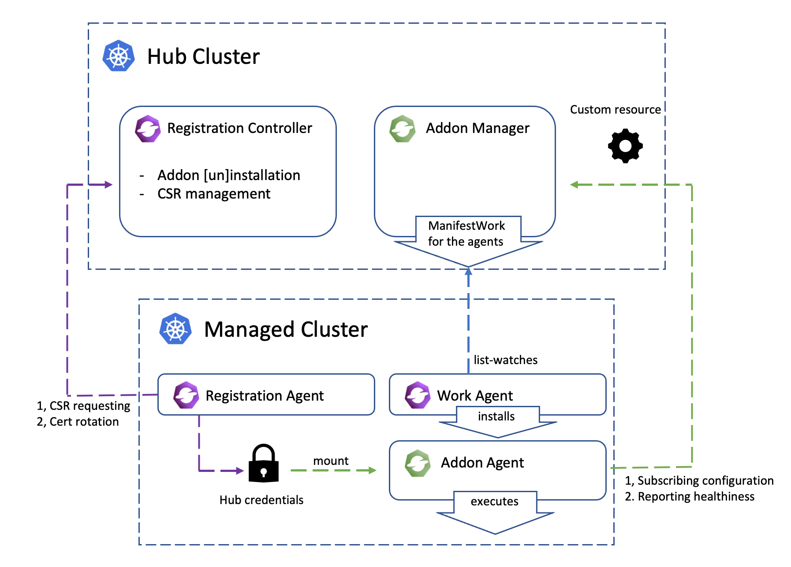

2023年5月24日 [殷智伟](https://github.com/zhiweiyin318)



##  OCM add-on插件概述

OCM （open-cluster-management）是一个专注于Kubernetes应用跨多集群和多云的管理平台，
提供了集群的注册，应用和负载的分发，调度等基础功能。Add-on插件是OCM提供的一种基于基础组建
的扩展机制，可以让Kubernetes生态的应用很容易迁移到OCM平台上，拥有跨多集群多云的编排和调度的能力。

在OCM平台上，add-on插件可以实现不同被管理集群（Spoke）上应用的不同的配置，也可以实现从控制面（Hub）
获取数据到Spoke集群上等功能。比如：你可以使用[managed-serviceaccount](https://github.com/open-cluster-management-io/managed-serviceaccount)
add-on插件在Spoke集群上将指定的ServiceaCount信息返回给Hub集群，可以使用[cluster-proxy](https://github.com/open-cluster-management-io/cluster-proxy)
add-on插件建立一个从spoke到hub的反向代理通道。

现阶段OCM社区已经有的一些add-on：
* [Application lifecycle management](https://open-cluster-management.io/zh/getting-started/integration/app-lifecycle/) 
  add-on插件提供了一套通过Subscriptions订阅channel，将github仓库，Helm release或者对象存储仓库的应用分发到指定Spoke集群上的机制。
* [Cluster proxy](https://open-cluster-management.io/getting-started/integration/cluster-proxy/) add-on插件通过反向代理通道提供了Hub和Spoke集群之间L4网络连接。
* [Managed service account](https://open-cluster-management.io/getting-started/integration/managed-serviceaccount/) 
  add-on插件可以让Hub集群管理员很容易管理Spoke集群上serviceaccount。
* [Policy framework](https://open-cluster-management.io/getting-started/integration/policy-framework/) 和 
  [Policy controllers](https://open-cluster-management.io/getting-started/integration/policy-controllers/) 
  add-on插件可以让Hub集群管理员很轻松为Spoke集群部署安全相关的policy策略。
* [Submarine Addon](https://github.com/stolostron/submariner-addon) add-on插件可以让[Submarine](https://github.com/submariner-io/submariner)
  和OCM方便集成，为被管理集群提供跨集群的Pod和Service网络互相访问的能力。
* [Multicluster Mesh Addon](https://github.com/stolostron/multicluster-mesh-addon) add-on插件为OCM被管理集群提供了跨集群Service Mesh服务。


本文将详细介绍add-on插件的实现机制。

## OCM add-on 插件实现机制

通常情况下一个add-on插件包含2部分组成：
1. `Add-on Agent` 是运行在Spoke集群上的任何Kubernetes资源，比如可以是一个有访问Hub权限的Pod，可以是一个Operator，等等。
2. `Add-on Manager` 是运行中Hub集群上的一个Kubernetes控制器。这个控制器可以通过[ManifestWork](https://open-cluster-management.io/concepts/manifestwork/)
   来给不同Spoke集群部署分发`Add-on Agent`所需要的Kubernetes资源, 也可以管理`Add-on Agent`所需要的权限等。

在OCM Hub集群上，关于add-on插件有2个主要的API：
1. `ClusterManagementAddOn`: 这是一个cluster-scoped的API，每个add-on插件必须创建一个同名的实例用来描述add-on插件的名字
   和描述信息，以及配置，安装部署策略等。
2. `ManagedClusterAddOn`: 这是一个namespace-scoped的API，部署到spoke集群的namespace下的和add-on同名的实例用来触发
   `Add-on Agent`安装部署到该Spoke集群。我们也可以通过这个API获取这个add-on插件的agent的健康状态信息。

Add-on 插件架构如下：

<div style="text-align: center; padding: 20px;">
   
</div>

创建：

`Add-on Manager` 监控`managedClusterAddOn` 来创建`manifestWork`把`Add-on Agent`部署到Spoke集群上，也可以根据
配置的部署策略只将agent部署到策略选中的集群上。 

注册：

如果`Add-on Agent` 需要访问Hub集群，`registration-agent`会根据`managedClusterAddOn` 中的注册信息来向Hub集群
发起CSR请求来申请访问Hub集群的权限，`Add-on Manager` 根据自定义的approve策略来检查CSR请求，approve后，创建对应的RBAC
权限给agent，`registration-agent` 会生成一个含有指定权限的kubeconfig secret， agent可以通过这个secret来访问Hub集群。

原生Kubernetes CSR只支持`kubernetes.io/kube-apiserver-client`,`kubernetes.io/kube-apiserver-client-kubelet`
和`kubernetes.io/kubelet-serving` 这几种签名者（signer），我们可以提供让用户自定义证书和签名者来访问非kube-apiserver的服务，
在`Add-on Manager`上可以自定义验证签名者和证书是否正确来完成add-on的注册。

健康检查：

`Add-on Agent`可以通过`addon-framework`提供的lease功能在Spoke集群上维护一个lease，`registration-agent` 监控这个Lease，
并通过Lease状态判断Agent是否健康，并更新到Hub集群的`managedClusterAddOn`的`Available`状态中。用户也可以通过其他自定义方式
来进行agent的健康检查，比如通过Add-on ManifestWork中某个资源的字段来判断agent是否健康。

开发：

OCM 社区提供了一个[addon-framework](https://github.com/open-cluster-management-io/addon-framework)的库，
可以方便开发者快速开发自己的add-on插件Manager，也可以将自己的Kubernetnes 应用通过addon-framework便捷的以add-on插件的
形式迁移到OCM多集群上。

开发者将自己的Agent侧要部署的资源以Helm Chart或者Go Template的形式直接拷贝到工程目录，通过调用[addonfactory](https://github.com/open-cluster-management-io/addon-framework/blob/main/pkg/addonfactory/addonfactory.go)就可以完成整个add-on注册，配置，健康检查等所有功能。详细请
参考[add-on 开发指引](https://open-cluster-management.io/developer-guides/addon/). 

## 例子

我们以`addon-framework`中的[helloworldhelm](https://github.com/open-cluster-management-io/addon-framework/tree/main/examples) 
add-on插件来举例。 这个add-on插件例子是将Hub集群上集群namespace下的configmap同步到Spoke集群上。

首先我们用KinD创建2个集群，一个当Hub集群安装OCM，并将另一个作为Spoke集群，以cluster1的名字注册到Hub集群。
可以参考[OCM安装](https://open-cluster-management.io/zh//getting-started/)。

```bash
$ kubectl get mcl
NAME       HUB ACCEPTED   MANAGED CLUSTER URLS   JOINED   AVAILABLE   AGE
cluster1   true           https://localhost      True     True        17s
```

然后在Hub集群上安装`helloworldhelm` add-on插件的`Add-on Manager`控制器。 具体步骤参考[部署helloworldhelm add-on](https://github.com/open-cluster-management-io/addon-framework/tree/main/examples)。

```bash
$ kubectl get deployments.apps -n open-cluster-management helloworld-controller
NAME                        READY   UP-TO-DATE   AVAILABLE   AGE
helloworldhelm-controller   1/1     1            1           50s
```

在Hub集群上我们可以看到`helloworldhelm` add-on插件的`ClusterManagementAddOn`：
```bash
$ kubectl get clustermanagementaddons.addon.open-cluster-management.io helloworldhelm -o yaml
apiVersion: addon.open-cluster-management.io/v1alpha1
kind: ClusterManagementAddOn
metadata:
  creationTimestamp: "2023-05-28T14:12:32Z"
  generation: 1
  name: helloworldhelm
  resourceVersion: "457615"
  uid: 29ac6292-7346-4bc9-8013-fd90f40589d6
spec:
  addOnMeta:
    description: helloworldhelm is an example addon created by helm chart
    displayName: helloworldhelm
  installStrategy:
    type: Manual
  supportedConfigs:
  - group: addon.open-cluster-management.io
    resource: addondeploymentconfigs
  - group: ""
    resource: configmaps
```

给cluster1 集群上部署`helloworldhelm` add-on, agent部署到Spoke集群的`open-cluster-management-agent-addon` namespace。
```bash
$ clusteradm addon enable --names helloworldhelm --namespace open-cluster-management-agent-addon --clusters cluster1
```

我们看到Hub集群上cluster1的namespace下部署了一个`managedClusterAddon`:
```bash 
$ kubectl get managedclusteraddons.addon.open-cluster-management.io -n cluster1 helloworldhelm -o yaml
apiVersion: addon.open-cluster-management.io/v1alpha1
kind: ManagedClusterAddOn
metadata:
  creationTimestamp: "2023-05-28T14:13:56Z"
  finalizers:
  - addon.open-cluster-management.io/addon-pre-delete
  generation: 1
  name: helloworldhelm
  namespace: cluster1
  ownerReferences:
  - apiVersion: addon.open-cluster-management.io/v1alpha1
    blockOwnerDeletion: true
    controller: true
    kind: ClusterManagementAddOn
    name: helloworldhelm
    uid: 29ac6292-7346-4bc9-8013-fd90f40589d6
  resourceVersion: "458003"
  uid: 84ceac57-3a7d-442f-bc28-d9828023d880
spec:
  installNamespace: open-cluster-management-agent-addon
status:
  conditions:
  - lastTransitionTime: "2023-05-28T14:13:57Z"
    message: Registration of the addon agent is configured
    reason: SetPermissionApplied
    status: "True"
    type: RegistrationApplied
  - lastTransitionTime: "2023-05-28T14:13:57Z"
    message: manifests of addon are applied successfully
    reason: AddonManifestApplied
    status: "True"
    type: ManifestApplied
  - lastTransitionTime: "2023-05-28T14:13:57Z"
    message: client certificate rotated starting from 2023-05-28 14:08:57 +0000 UTC
      to 2024-05-27 14:08:57 +0000 UTC
    reason: ClientCertificateUpdated
    status: "True"
    type: ClusterCertificateRotated
  - lastTransitionTime: "2023-05-28T14:15:04Z"
    message: helloworldhelm add-on is available.
    reason: ManagedClusterAddOnLeaseUpdated
    status: "True"
    type: Available
  namespace: open-cluster-management-agent-addon
  registrations:
  - signerName: kubernetes.io/kube-apiserver-client
    subject:
      groups:
      - system:open-cluster-management:cluster:cluster1:addon:helloworldhelm
      - system:open-cluster-management:addon:helloworldhelm
      - system:authenticated
      user: system:open-cluster-management:cluster:cluster1:addon:helloworldhelm:agent:8xz2x
  supportedConfigs:
  - group: ""
    resource: configmaps
  - group: addon.open-cluster-management.io
    resource: addondeploymentconfigs
```

在Hub集群上的cluster1 namespace下，我们还可以看到部署add-on agent对应的`manifestWork`。
```bash
$ kubectl get manifestwork -n cluster1
NAME                            AGE
addon-helloworldhelm-deploy-0   7m18s
```

在Spoke集群cluster1上，我们可以看到agent部署在了`open-cluster-management-agent-addon` namespace下, 
agent通过绑定hub的kubeconfig来访问Hub同步configmap。
```bash
$ kubectl get deployments.apps -n open-cluster-management-agent-addon
NAME                   READY   UP-TO-DATE   AVAILABLE   AGE
helloworldhelm-agent   1/1     1            1           8m17s

$ kubectl get secret -n open-cluster-management-agent-addon
NAME                                  TYPE                                  DATA   AGE
helloworldhelm-hub-kubeconfig         Opaque                                3      8m17s
```

## OCM add-on最新的改进和计划

在最新发布的OCM v0.11.0版本中，我们对add-on进行了很多功能的增强：
1. 在Hub集群上有专门的[addon-manager](https://github.com/open-cluster-management-io/enhancements/tree/main/enhancements/sig-architecture/12-addon-manager)
组建来管理add-on插件的配置和生命周期。
2. 特别增强了[add-on生命周期的管理](https://github.com/open-cluster-management-io/enhancements/tree/main/enhancements/sig-architecture/81-addon-lifecycle)，升级了`ClusterManagementAddon` 和 `ManagedClusterAddOn`这两个API，
用户可以通过和[Placement](https://github.com/open-cluster-management-io/placement)结合对指定集群上的add-on进行滚动升级和金丝雀升级。
3. 我们还在设计一种新的add-on API [AddonTemplate](https://github.com/open-cluster-management-io/enhancements/tree/main/enhancements/sig-architecture/82-addon-template) 来让用户不用进行代码开发就可以轻松实现自己的add-on插件的部署安装。
