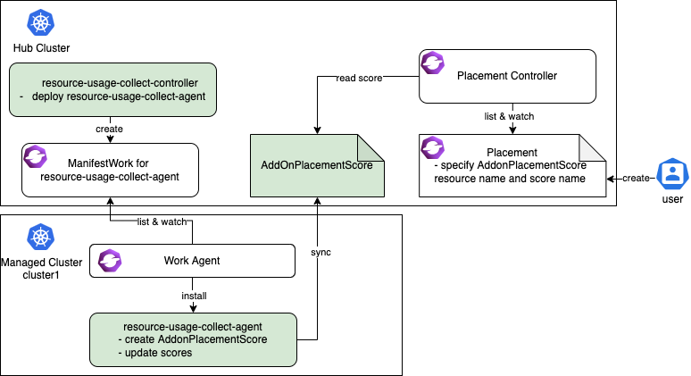

2023年5月10日 [郝青](https://github.com/haoqing0110)



## 背景问题

OCM Placement API 可以动态的在多集群环境中选择一组托管集群`ManagedCluster`，以便将工作负载部署到这些集群上。

在上一篇[CNCF 沙箱项目 OCM Placement 多集群调度指南](https://mp.weixin.qq.com/s/_k2MV4b3hfTrLUCCOKOG8g)中，我们详细介绍了 Placement 的基本概念，提供的调度功能以及调度流程。同时还通过示例展示了如何在不同的应用场景下使用 Placement API。建议首次接触 Placement 的读者先阅读此文。

Placement 提供了通过标签选择器`labelSelector`或声明选择器`claimSelector`过滤集群，同时也提供了一些内置的优选器`prioritizer`，可对过滤后的集群进行打分排序和优先选择。
内置的`prioritizer`中包括了最大可分配 CPU 资源(ResourceAllocatableCPU)和最大可分配内存资源(ResourceAllocatableMemory)，它们提供了根据集群的可分配 CPU 和内存进行调度的能力。但是，由于集群的"AllocatableCPU"和"AllocatableMemory"是静态值，即使"集群资源不足"，它们也不会改变。这导致在实际使用中，这两个`prioritizer`不能满足基于实时可用 CPU 或内存进行调度的需求。此外，使用者还可能需要根据从集群中获取的资源监控数据进行调度，这些都是内置的`prioritizer`无法满足的需求。

以上这些需求要求 Placement 能够更灵活的根据第三方数据来进行调度。为此，我们实现了一种更具扩展性的方式来支持基于第三方数据的调度，使用者可以使用自定义的分数来选择集群。

本文将介绍 OCM 是如何让多集群调度更具可扩展性，并通过实例展示如何实现一个第三方数据控制器`controller`来扩展 OCM 的多集群调度功能。

## OCM 如何让调度具有可扩展性

为了实现基于第三方数据的调度，OCM 引入了 API `AddOnPlacementScore`，它支持存储自定义的集群分数，使用者可以在 Placement 中指定使用此分数选择集群。

如下是一个`AddOnPlacementScore`的例子，更多关于 API 的细节可访问[types_addonplacementscore.go](https://github.com/open-cluster-management-io/api/blob/main/cluster/v1alpha1/types_addonplacementscore.go "types_addonplacementscore.go")。

```yaml
apiVersion: cluster.open-cluster-management.io/v1alpha1
kind: AddOnPlacementScore
metadata:
  name: default
  namespace: cluster1
status:
  conditions:
  - lastTransitionTime: "2021-10-28T08:31:39Z"
    message: AddOnPlacementScore updated successfully
    reason: AddOnPlacementScoreUpdated
    status: "True"
    type: AddOnPlacementScoreUpdated
  validUntil: "2021-10-29T18:31:39Z"
  scores:
  - name: "cpuAvailable"
    value: 66
  - name: "memAvailable"
    value: 55
```

`AddOnPlacementScore`的主要内容都在`status`中，因为我们不希望使用者更新它。`AddOnPlacementScore`的生命周期维护及`scores`的更新应该由第三方`controller`负责。

- `conditions`包括了资源不同的条件状态。
- `scores`是一个列表，包含了一组分数的名称和值。在上例中，`scores`包含了自定义分数 cpuAvailable 和 memAvailable。
- `validUntil`定义了`scores`的有效时间。在此时间之后，分数被 Placement 视为无效，nil 代表永不过期。controller 需要在更新 score 时更新此字段，保证分数是最新状态。

作为使用者，需要知道`AddOnPlacementScore`的资源名称`default`和`socre`名称`cpuAvailable` `memAvailable`。之后可在 Placement 中指定用此分数选择集群。

例如，下面的 Placement 想要选择具有最高`cpuAvailable`分数的前 3 个集群。

```yaml
apiVersion: cluster.open-cluster-management.io/v1beta1
kind: Placement
metadata:
  name: placement
  namespace: ns1
spec:
  numberOfClusters: 3
  prioritizerPolicy:
    mode: Exact
    configurations:
      - scoreCoordinate:
          type: AddOn
          addOn:
            resourceName: default
            scoreName: cpuAvailable
        weight: 1
```

[32-extensiblescheduling](https://github.com/open-cluster-management-io/enhancements/blob/main/enhancements/sig-architecture/32-extensiblescheduling/32-extensiblescheduling.md "32-extensiblescheduling")包含了关于此设计的详细内容。

接下来，将用一个示例展示如何实现一个 controller 来更新`score`，并使用此`score`选择集群。

## 示例

示例代码位于 GitHub 仓库[resource-usage-collect-addon](https://github.com/open-cluster-management-io/addon-contrib/tree/main/resource-usage-collect-addon "resource-usage-collect-addon")。它提供的分数可实时反映集群的 CPU 和内存利用率。

示例使用 OCM [addon-framework](https://github.com/open-cluster-management-io/addon-framework "addon-framework") 进行开发，它可以作为一个 addon 插件被安装到每个`ManagedCluster`上，并将集群的`score`更新到对应的`AddOnPlacementScore`中。（本文不涉及 addon 开发细节，详细内容可参考[add-on 开发指南](https://open-cluster-management.io/developer-guides/addon/ "add-on开发指南")。）

resource-usage-collect addon 遵循`hub-agent`的架构，如下所示。



resource-usage-collect addon 包括了一个 hub 上的 manager 和 managed cluster 上的 agent（绿色部分）。

工作流程为：

- hub 上运行 addon 的 manager，它负责在 hub 上为每个 agent 创建部署所需的`ManifestWork`。
- 在每个 managed cluster 上，work agent 负责监控 hub 上的`ManifestWork`并在 managed cluster 上安装 agent。
- agent 是 addon 的核心部分，它负责为每个 managed cluster 创建`AddonPlacementScore`，并每 60 秒刷新一次`scores`和`validUntil`。
- 当`AddonPlacementScore`创建完成，用户便可以在`Placement`中指定`AddOnPlacementScore`的资源名称和`score`名称，根据分数来选择集群。
- Placement controller 会在每个集群的命名空间中获取`AddOnPlacementScore`资源，在`scores`列表中读取分数，并使用该分数对集群进行打分排序。

上述是`AddonPlacementScore`和 placement controller 的工作流程，非常容易理解。下面我们来试着运行样例代码。

**准备 OCM 环境（包含 2 个`ManagedCluster`）**

1. 运行[setup dev environment by kind](https://github.com/open-cluster-management-io/OCM/tree/main/solutions/setup-dev-environment "setup dev environment by kind")准备环境。

```bash
curl -sSL https://raw.githubusercontent.com/open-cluster-management-io/OCM/main/solutions/setup-dev-environment/local-up.sh | bash
```

2. 确认两个`ManagedCluster`和一个默认的`ManagedClusterSet`创建完成。

```bash
$ clusteradm get clusters
NAME       ACCEPTED   AVAILABLE   CLUSTERSET   CPU   MEMORY       KUBERENETES VERSION
cluster1   true       True        default      24    49265496Ki   v1.23.4
cluster2   true       True        default      24    49265496Ki   v1.23.4

$ clusteradm get clustersets
NAME      BOUND NAMESPACES   STATUS
default                      2 ManagedClusters selected
```

3. 将默认`ManagedClusterSet`绑定到 default`Namespace`。

```bash
clusteradm clusterset bind default --namespace default
```

```bash
$ clusteradm get clustersets
NAME      BOUND NAMESPACES   STATUS
default   default            2 ManagedClusters selected
```

**安装 resource-usage-collect addon**

1. 下载源代码。

```bash
git clone git@github.com:open-cluster-management-io/addon-contrib.git
cd addon-contrib/resource-usage-collect-addon
```

2. 编译容器镜像。

```bash
# Set image name, this is an optional step.
export IMAGE_NAME=quay.io/haoqing/resource-usage-collect-addon:latest
# Build image
make images
```

如果你使用了 kind，需要手工将镜像加载到 kind 环境中。

```bash
kind load docker-image $IMAGE_NAME --name <cluster_name> # kind load docker-image $IMAGE_NAME --name hub
```

3. 部署 resource-usage-collect addon。

```bash
make deploy
```

4. 验证安装成功。

在 hub 集群上, 验证 resource-usage-collect-controller pod 运行成功。

```bash
$ kubectl get pods -n open-cluster-management | grep resource-usage-collect-controller
resource-usage-collect-controller-55c58bbc5-t45dh   1/1     Running   0          71s
```

在 hub 集群上, 验证每个 managed cluster 生成了对应的`AddonPlacementScore`。

```bash
$ kubectl get addonplacementscore -A
NAMESPACE   NAME                   AGE
cluster1    resource-usage-score   3m23s
cluster2    resource-usage-score   3m24s
```

`AddonPlacementScore`的 status 中应该包含了如下的分数。

```bash
$ kubectl get addonplacementscore -n cluster1 resource-usage-score -oyaml
apiVersion: cluster.open-cluster-management.io/v1alpha1
kind: AddOnPlacementScore
metadata:
  creationTimestamp: "2022-08-08T06:46:04Z"
  generation: 1
  name: resource-usage-score
  namespace: cluster1
  resourceVersion: "3907"
  uid: 6c4280e4-38be-4d45-9c73-c18c84799781
status:
  scores:
  - name: cpuAvailable
    value: 12
  - name: memAvailable
    value: 4
```

如果`AddonPlacementScore`没有生成或者 status 中没有分数，可以登陆到 managed cluster 上，检查 resource-usage-collect-agent pod 是否正常运行。

```bash
$ kubectl get pods -n default | grep resource-usage-collect-agent
resource-usage-collect-agent-5b85cbf848-g5kqm   1/1     Running   0          2m
```

**通过自定义分数选择集群**

如果上述步骤运行正常，接下来我们可以试着创建一个`Placement`并通过自定义分数选择集群。

1. 创建一个`Placement`选择具有最高 cpuAvailable 分数的集群。

当`scoreCoordinate`的类型`type`定义为`AddOn`时，placement controller 会在每个集群的命名空间中获取名称为`resource-usage-score`的`AddOnPlacementScore`资源，在`scores`列表中读取分数`cpuAvailable`，并使用该分数对集群进行打分排序。

```bash
cat << EOF | kubectl apply -f -
apiVersion: cluster.open-cluster-management.io/v1beta1
kind: Placement
metadata:
  name: placement1
  namespace: default
spec:
  numberOfClusters: 1
  clusterSets:
    - default
  prioritizerPolicy:
    mode: Exact
    configurations:
      - scoreCoordinate:
          type: AddOn
          addOn:
            resourceName: resource-usage-score
            scoreName: cpuAvailable
        weight: 1
EOF
```

2. 验证`PlacementDecision`。

```bash
$ kubectl describe placementdecision -n default | grep Status -A 3
Status:
  Decisions:
    Cluster Name:  cluster1
    Reason:
```

可以看到 Cluster1 被选中，出现在`PlacementDecision`的结果中。

运行如下命令获取`AddonPlacementScore`的自定义分数。可以看到"cpuAvailable"的分数是 12。

```bash
$ kubectl get addonplacementscore -A -o=jsonpath='{range .items[*]}{.metadata.namespace}{"\t"}{.status.scores}{"\n"}{end}'
cluster1        [{"name":"cpuAvailable","value":12},{"name":"memAvailable","value":4}]
cluster2        [{"name":"cpuAvailable","value":12},{"name":"memAvailable","value":4}]
```

在`Placement`的 events 也可以看到集群的分数是 12 分。这表明自定义分数被直接用于对集群进行打分和排序。由于上述 placement 中 numberOfClusters 定义为 1，最终只有 cluster1 被选中。

```bash
$ kubectl describe placement -n default placement1 | grep Events -A 10
Events:
  Type    Reason          Age   From                 Message
  ----    ------          ----  ----                 -------
  Normal  DecisionCreate  50s   placementController  Decision placement1-decision-1 is created with placement placement1 in namespace default
  Normal  DecisionUpdate  50s   placementController  Decision placement1-decision-1 is updated with placement placement1 in namespace default
  Normal  ScoreUpdate     50s   placementController  cluster1:12 cluster2:12
```

## 如何实现自定义分数控制器

现在你已经知道了如何安装 resource-usage-collect addon 并使用自定义分数来选择群集。接下来，让我们深入了解在实现自定义分数控制器`controller`时需要考虑的一些关键点。

### 1. 在哪里运行自定义分数控制器 (controller)

Controller 可以在 hub 集群或 managed cluster 上运行。可以结合具体的使用场景，选择将 controller 运行在何处。

比如，在我们的示例中，自定义分数控制器`controller`是使用 addon-famework 开发的，它遵循 hub-agent 架构。resource-usage-collect-agent 真正运行自定义分数程序，它安装在每个 managed cluster 上，获取 managed cluster 的可用 CPU 和内存，计算分数，并将其更新到`AddonPlacementScore`中。resource-usage-collect-controller 只负责安装代理 agent。

在其他情况下，例如，如果想使用 Thanos 中的指标为每个 managed cluster 计算得分，则自定义分数控制器`controller`需要放置在 hub 上，因为 Thanos 有从每个 managed cluster 收集的所有指标。

### 2. 如何维护`AddOnPlacementScore`的生命周期

在我们的示例中，维护`AddonPlacementScore`的代码位于[pkg/addon/agent/agent.go](https://github.com/open-cluster-management-io/addon-contrib/blob/main/resource-usage-collect-addon/pkg/addon/agent/agent.go "pkg/addon/agent/agent.go")中。

- 何时创建`AddonPlacementScore`？

  `AddonPlacementScore`可以在 managed cluster 创建完成后创建，或者按需创建以减少 hub 上的 resource。

  在上述示例中，addon 在 managed cluster 创建完成后，为每个 managed cluster 创建对应的`AddonPlacementScore`，并且生成初始分数。

- 何时更新`AddonPlacementScore`？

  可以在监视数据发生变化时更新分数，或者至少在`ValidUntil`到期之前更新分数。
  我们建议在更新分数时设置`ValidUntil`，以便 placement controller 可以知道分数是否仍然有效，防止分数长时间未能更新的情况。

  在上述示例中，除了每 60 秒重新计算和更新分数外，当 managed cluster 中的节点或 Pod 资源发生更改时，也将触发更新。

### 3. 如何计算分数

计算分数的代码位于[pkg/addon/agent/calculate.go](https://github.com/open-cluster-management-io/addon-contrib/blob/main/resource-usage-collect-addon/pkg/addon/agent/calculate.go "pkg/addon/agent/calculate.go")。有效的得分必须在-100 至 100 的范围内，你需要在将分数更新到`AddOnPlacementScore`之前将其归一化。在归一化分数时，可能会遇到以下情况。

- 分数提供程序知道自定义分数的最大值和最小值。

  在这种情况下，可以通过公式轻松实现平滑映射。假设实际值为 X，并且 X 在间隔[min，max]中，则得分=200 \*（x-min）/（max-min）-100

- 分数提供程序不知道自定义分数的最大值和最小值。

  在这种情况下，需要自己设置最大值和最小值，因为如果没有最大值和最小值，则无法将单个值 X 映射到范围[-100,100]。
  然后，当 X 大于此最大值时，可以认为群集足够健康可以部署应用程序，可以将分数设置为 100。如果 X 小于最小值，则可以将分数设置为-100。

  ```
  if X >= max
    score = 100
  if X <= min
    score = -100
  ```

在我们的示例中，运行在每个托管群集上的 resource-usage-collect-agent 没有全局视角，无法知道所有群集的 CPU/内存使用率的最大值/最小值，因此我们在代码中手动将最大值设置为`MAXCPUCOUNT`和`MAXMEMCOUNT`，最小值设置为 0。分数计算公式可以简化为：`score = x / max * 100`。

## 总结

在本文中，我们介绍了什么是OCM的可扩展调度，并使用示例展示了如何实现自定义分数控制器。此外，本文列出了开发者在实现第三方分数控制器时需要考虑的3个关键点。希望阅读本文后，您可以清楚地了解到如何使用OCM 来扩展多集群调度能力。